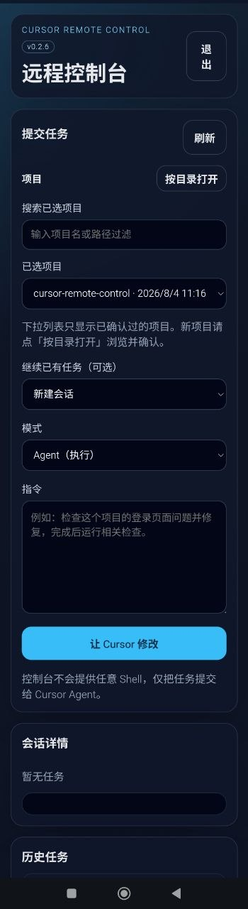

# Cursor 远程控制台

[中文](./README.md) | [English](./README.en.md)

一个运行在 **Windows 本机** 的 Web 控制台，用手机浏览器提交任务给 Cursor Agent，让它修改本机项目。

界面右上角可切换中文 / English；语言偏好会保存在浏览器本地。

推荐直接用本机 Node.js + pnpm 运行。Cursor SDK 本地模式需要访问本机项目、凭据和开发环境；Docker 容器里往往缺少这些组件，因此 Docker 仅作可选备用，日常请用宿主机启动。



## 功能

- 管理员账号密码登录，默认用户名为 `admin`。
- 默认监听端口 `20267`。
- 支持在 `PROJECT_ROOTS` 范围内按目录浏览并确认项目；下拉列表只显示已确认过的项目。
- 通过 Cursor SDK 的本地模式在项目目录中执行 Agent 任务。
- 保存任务历史、运行状态、Agent ID、Run ID 和日志。一个任务即一轮会话，可在同一任务内追加多轮指令。任务进行中时默认排队，也可点「追加」中断当前轮立刻执行。
- 支持 PWA，可在手机浏览器中安装到主屏幕。
- 界面支持中文 / English 切换。
- 不提供任意 Shell 输入框，网页不能直接执行系统命令。

## 环境要求

- Windows 本机（非容器）
- Node.js 22+
- [pnpm](https://pnpm.io/) 最新版
- 本机已可用的 Cursor / Cursor SDK 本地环境与 `CURSOR_API_KEY`

## 初始化

在 PowerShell 7 中执行（建议已设置 UTF-8）：

```powershell
cd D:\code\cursor-remote-control
pnpm install
Copy-Item .env.example .env
pnpm init-admin
```

`pnpm init-admin` 会生成高强度随机密码，并写入 `.env` 中的密码哈希和 Session 密钥。密码只显示一次，请立即保存。

然后编辑 `.env`：

```env
CURSOR_API_KEY=cursor_xxx
PROJECT_ROOTS=E:\code;D:\code;C:\code
COOKIE_SECURE=false
```

`PROJECT_ROOTS` 使用英文分号分隔多个目录，路径为本机 Windows 路径。建议只配置项目根目录，不要配置整个系统盘。

本服务只监听 HTTP；若前面有 Nginx / Cloudflare 等 HTTPS 反代，请设置：

```env
COOKIE_SECURE=true
PUBLIC_BASE_URL=https://your.example.com
```

并确保反代向本机转发 `X-Forwarded-Proto: https`（以及常用的 `X-Forwarded-For` / `Host`）。会话 Cookie 的 `Secure` 按「用户侧是否 HTTPS」判断，不是按 Node 监听协议。

## 启动（宿主机）

开发模式：

```powershell
pnpm dev
```

生产模式：

```powershell
pnpm build
pnpm start
```

### 开机自启

登录后延迟启动（默认 60 秒），关闭 Cursor 后服务仍可运行：

```powershell
pnpm build
pnpm autostart:install
```

自定义延迟：

```powershell
pwsh -File scripts/install-autostart.ps1 -DelaySeconds 120
```

立即后台启动 / 取消自启：

```powershell
pnpm autostart:start
pnpm autostart:uninstall
```

`autostart:install` 注册的是守护进程：每约 15 秒检查 20267，服务挂了才拉起，**不会结束已经在跑的进程**。日志在 `data/watchdog.log`。当前服务还活着时，可在另一个 PowerShell 窗口执行 `pnpm autostart:watch` 先挂上守护；`pnpm autostart:watch:stop` 只停守护、不停 Node。

访问：

```text
http://127.0.0.1:20267
```

公网反代时，把 HTTPS 域名转发到本机 `20267` 端口。运行时数据写在项目下的 `data/` 目录（不要用 Docker named volume）。

从 Docker 切回宿主机时：

1. 停止并移除正在运行的 compose 服务（例如 `docker compose down`）。
2. 确认 `.env` 里 `PROJECT_ROOTS` 已是 Windows 路径（如 `E:\code;D:\code;C:\code`），不要再使用容器内的 `/workspace/...`。
3. `DATA_DIR` 保持 `./data`，可继续使用已有 `data/` 下的任务与会话文件。
4. 执行 `pnpm install`（如尚未安装依赖），再 `pnpm build && pnpm start` 或 `pnpm dev`。

## 安装到手机

通过 HTTPS 域名打开控制台后，页面右上角会在浏览器满足安装条件时显示“安装”按钮。Chromium 会弹出系统安装提示；iOS Safari 不会触发该事件，点击后会提示用分享菜单“添加到主屏幕”。

PWA 安装依赖：

- HTTPS 或本机 `localhost`（普通 HTTP 公网地址通常无法安装）
- 有效的 Web App Manifest（含 192 与 512 的 PNG 图标）
- 已注册的 Service Worker

图标变更后可执行 `pnpm generate-icons` 重新从 SVG 生成 PNG。

## Docker（不推荐，仅备用）

仓库仍保留 `Dockerfile`、`docker-compose.yml`，镜像基于 `node:alpine`，端口 `20267:20267`，数据通过绑定挂载到 `./data`。

**不建议日常使用。** 容器内通常缺少 Cursor 本地 Agent、凭据与完整开发工具链，任务容易失败或行为与本机不一致。仅在明确需要隔离实验、且已自行解决容器内 Cursor SDK 环境时再考虑。

若仍要用 compose 试跑，请注意：compose 会把 `PROJECT_ROOTS` 覆盖成容器内路径（如 `/workspace/d-code`），并挂载 Windows 盘符；这与宿主机 `.env` 中的 Windows 路径不是同一套配置，切回本机运行前务必改回 Windows 路径。

## 安全注意事项

- 不要把 `.env`、`data/` 下的运行时数据（如 `jobs.json`、`selected-projects.json`）或管理员密码提交到 Git。
- 公网访问必须使用 HTTPS，并把 `COOKIE_SECURE` 设置为 `true`。
- `PROJECT_ROOTS` 不要设置为整个系统盘，建议设置为 `E:\code;D:\code;C:\code` 这类项目根目录列表。
- 控制台只适合个人使用，不建议给多人共享管理员账号。
